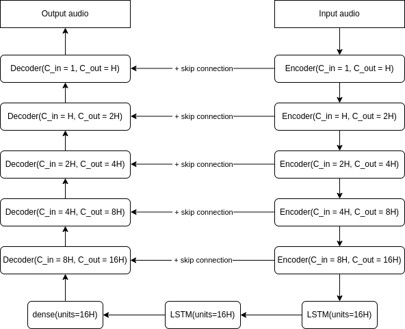
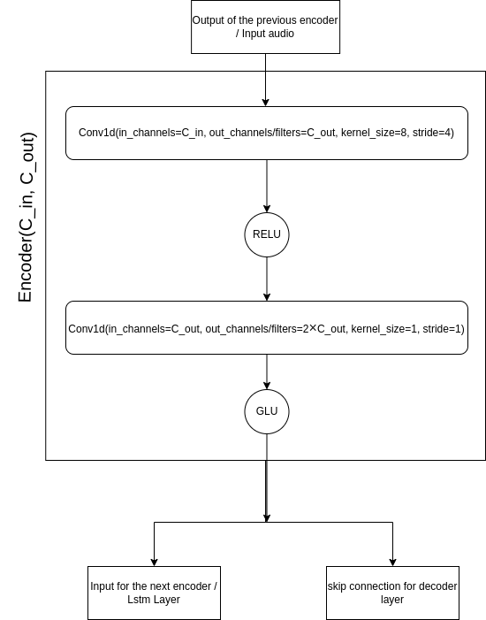
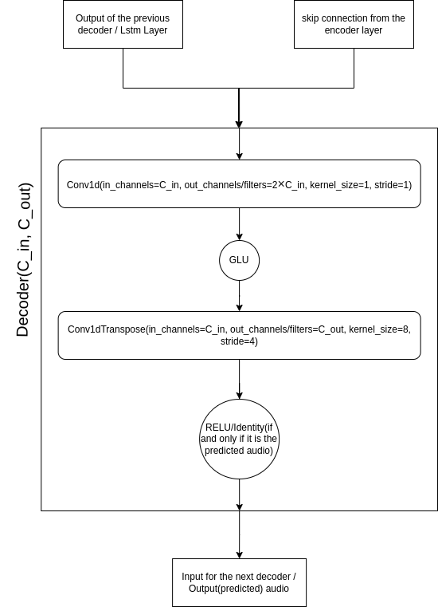

# Denoiser - speech enhancement in the waveform domain

## Model: Demucs

The basic architecture of **Demucs** model looks like this:

It is basically an unet model. The basic model, provided by facebook-research, is consist of 5 encoding layer and 5 decoding layer.  In between encoder and decoder we use two layer of lstm and one dense layer.

We can also increase number of encoder-decoder layer. The parameter of encoder-decoder layer gets 2x every time.

#### Encoder:

#### Decoder:

#### Conv1d:
You can read full documentation from [pytorch](https://pytorch.org/docs/stable/generated/torch.nn.Conv1d.html) and [tensorflow](https://www.tensorflow.org/api_docs/python/tf/keras/layers/Conv1D).

If we apply `Conv1d(in_channels=C_in, out_channels=C_out, kernel_size=k, stride=s)` on a $(B, L_{in}, C_{in})$ shaped input, and get an $(B, L_{out}, C_{out})$ shaped output, then $L_{out} = \lfloor \frac{L_{in}-k}{s}+1\rfloor$

#### Conv1dTranspose:
You can read full documentation from [pytorch](https://pytorch.org/docs/stable/generated/torch.nn.ConvTranspose1d.html) and [tensorflow](https://www.tensorflow.org/api_docs/python/tf/keras/layers/Conv1DTranspose).

If we apply `Conv1dTranspose(in_channels=C_in, out_channels=C_out, kernel_size=k, stride=s)` on a $(B, L_{in}, C_{in})$ shaped input, and get an $(B, L_{out}, C_{out})$ shaped output, then $L_{out} = (L_{in} - 1) \times s + k$

#### GLU:
You can read full documentation from [pytorch](https://pytorch.org/docs/stable/generated/torch.nn.GLU.html), [towardsdatascience](https://medium.com/deeplearningmadeeasy/glu-gated-linear-unit-21e71cd52081).
If we apply `GLU` activation on a $(B, L, C_{in})$ shaped input and get an $(B, L, C_{out})$ shaped output, then $C_{out} = \frac{C_{in}}{2}$.
We can apply convolution instead of Dense/Linear layer mentioned in [this](https://medium.com/deeplearningmadeeasy/glu-gated-linear-unit-21e71cd52081) blog. But in our case we ignore convolution layer also, because the model itself has a convolution layer without any activation before the GLU layer, hence we can ignore that.

#### preprocessing inside the model architecture:

##### upsample2:
It doubles the sample rate of the Input audio. Hence, if our input shape is $(B, L, C)$, our output shape will be $(B, 2\times L, C)$
##### downsample2:
It half the sample rate of the Input audio. Hence, if our input shape is $(B, L, C)$, our output shape will be $(B, 2\times L, C)$

##### Normalize:

After the input layer at first we apply normalization(here the normalizing factor is the standard deviation of the waveform) to the waveform, and before the output layer we scale the value with the normalizing factor.

##### Zero Padding:

